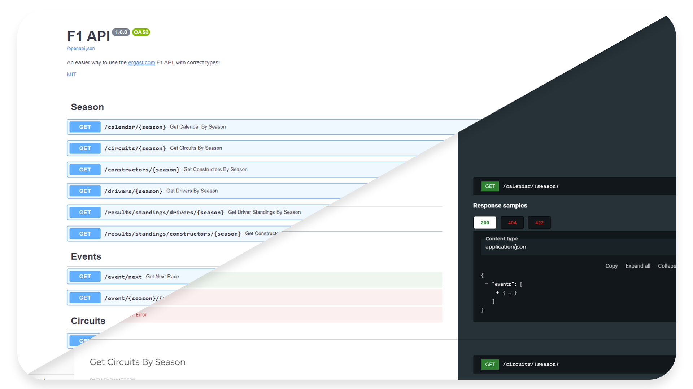

<a name="readme-top"></a>

<div>
<h3 align="center">F1API</h3>

  <p align="center">
    A more user-friendly way to use <a href="https://ergast.com/mrd/">ergast.com</a>
    <br />
    <a href="https://github.com/f1betting/F1API/issues">Report Bug</a>
    ·
    <a href="https://github.com/f1betting/F1API/issues">Request Feature</a>
  </p>
</div>


<!-- TABLE OF CONTENTS -->

## 📋 Table of contents

- [ℹ️ About The Project](#-about-the-project)
    - [🚧 Built With](#built-with)
- [🔨 Getting Started](#-getting-started)
    - [🚢 Running using Docker](#running-using-docker)
    - [🏡 Running locally](#running-locally)
- [🚀 Usage ](#-usage)
- [📜 License](#-license)

<!-- ABOUT THE PROJECT -->

## ℹ️ About The Project

A more user-friendly way to use [ergast.com](https://ergast.com/mrd/)!

<p align="right">(<a href="#readme-top">back to top</a>)</p>

### 🚧 Built With

* [![Python]][Python-url]
* [![FastAPI]][FastAPI-url]

<p align="right">(<a href="#readme-top">back to top</a>)</p>


<!-- GETTING STARTED -->

## 🔨 Getting Started

Below are the instructions for running the API for development and general usage.

### 🚢 Running using Docker

1. You can use the docker image from the DockerHub [repository](https://hub.docker.com/r/nieko3/f1api) using:

   ````shell
   $ docker pull nieko3/f1api:latest
   ````

2. Run container using:

    ````shell
    $ docker run -d --name f1api -p 8000:80 nieko3/f1api:latest
    ````

### 🏡 Running locally

1. Install dependencies with pip using:

   ````shell
   $ pip install -r requirements.txt
   ````

2. Run ``uvicorn`` server using:
   ````shell
   $ uvicorn app.main:app --reload --port 8000
   ````

<p align="right">(<a href="#readme-top">back to top</a>)</p>


<!-- USAGE EXAMPLES -->

## 🚀 Usage



A swagger browser is included at the ``/docs`` endpoint. Alternatively you can use the ``/redoc`` endpoint if you wish
to use redoc.

_For the OpenAPI specification, please refer
to [OpenAPI.json](https://github.com/f1betting/F1API/blob/main/OpenAPI.json)_

<p align="right">(<a href="#readme-top">back to top</a>)</p>


<!-- LICENSE -->

## 📜 License

Distributed under the MIT License. See `LICENSE.md` for more information.

<p align="right">(<a href="#readme-top">back to top</a>)</p>


<!-- MARKDOWN LINKS & IMAGES -->
<!-- https://www.markdownguide.org/basic-syntax/#reference-style-links -->

[Python]: https://img.shields.io/badge/python-3670A0?style=for-the-badge&logo=python&logoColor=ffdd54

[Python-url]: https://python.org

[FastAPI]: https://img.shields.io/badge/FastAPI-005571?style=for-the-badge&logo=fastapi

[FastAPI-url]: https://fastapi.tiangolo.com/